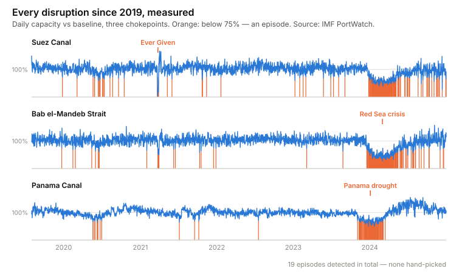
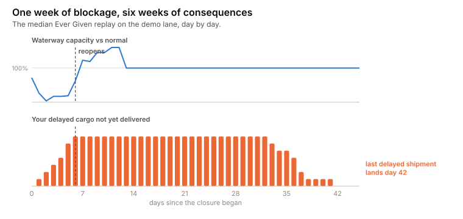
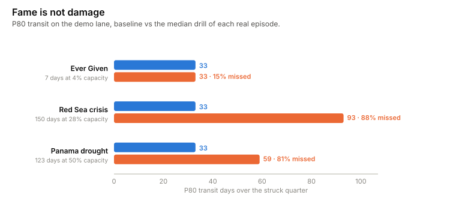

# lane-drill

[](https://github.com/rikardotoro/lane-drill/actions/workflows/ci.yml)

**Your building has fire drills. Your supply chain doesn't. This one takes 30 seconds.**

Buildings rehearse for fires on a schedule. Supply chains — which actually
failed in 2021 — almost never rehearse at all. This tool runs the rehearsal
for one shipping lane: it takes a real disruption, measured from public
satellite data, and replays it against your own shipment history. Not a
prediction. Not a black box. A drill.

It never invents a scenario. Every episode below was detected automatically
in IMF PortWatch's daily chokepoint data — the Ever Given, the Red Sea
crisis, the Panama drought, and sixteen less famous ones — and the tool
replays the *measured* shape: how deep capacity fell, for how long, and how
big the catch-up surge was afterwards.

<picture>
  <source media="(prefers-color-scheme: dark)" srcset="docs/charts/atlas-dark.svg">
  
</picture>

## The 30-second version

```bash
uvx --from git+https://github.com/rikardotoro/lane-drill lane-drill --demo
```

<!-- BEGIN OUTPUT -->
```
The drill — suez 2021-03-23 shape, 1000 replays on your lane
┏━━━━━━━━━━━━━━━━━┳━━━━━━━━━━┳━━━━━━━━━━━━━━┳━━━━━━━━━━━━━━┓
┃ Transit days    ┃ Baseline ┃ Median drill ┃ Worst decile ┃
┡━━━━━━━━━━━━━━━━━╇━━━━━━━━━━╇━━━━━━━━━━━━━━╇━━━━━━━━━━━━━━┩
│ P50             │       30 │           30 │           31 │
│ P80             │       33 │           33 │           34 │
│ P90             │       34 │           34 │           36 │
│ Promises missed │      12% │          16% │          26% │
└─────────────────┴──────────┴──────────────┴──────────────┘

In the median replay, 24% of the struck quarter's shipments are delayed (worst 
single delay 5 days), and the last disruption-delayed shipment lands 50 days 
after the waterway reopened.

The median replay, day by day:
  day   0  the waterway closes to 4% of normal capacity
  day   1  your first shipment joins the queue
  day   6  the waterway reopens — 10 of your shipments still waiting
  day  23  your backlog finally clears
  day  56  your last delayed shipment lands — 50 days after the reopening

Episode shape measured from IMF PortWatch, suez, 2021-03-23 to 2021-03-29 (depth
4%, 7 days).
This answers what if, never how likely.
```
<!-- END OUTPUT -->

The drill drops the episode at a thousand random points in your calendar
(that is the only random thing in it), queues your shipments through the
reduced capacity, and reports the quarter that gets hit: your percentiles,
your missed promises, your backlog — median case and worst decile.

## One week of blockage, six weeks of consequences

The Suez was blocked for a week in 2021. In the median replay on the demo
lane, the last disruption-delayed shipment lands **more than a month after
the waterway reopened** — the queue drains slowly, and everything in it
still has an ocean to cross. Damage outlives disruption. That is the single
most useful thing a drill teaches, and it is invisible in any report that
only looks at the disruption window itself.

<picture>
  <source media="(prefers-color-scheme: dark)" srcset="docs/charts/timeline-dark.svg">
  
</picture>

## Fame is not damage

Run all three famous episodes on the same lane and the ranking is the
opposite of the headlines. The week-long blockage everyone remembers barely
moves a quarter's P80 — a deep cut with a fast recovery surge is something
a lane absorbs. The slow grinds that fell out of the news — half capacity
for four months, a rerouted strait for five — are what destroy delivery
promises.

<picture>
  <source media="(prefers-color-scheme: dark)" srcset="docs/charts/impact-dark.svg">
  
</picture>

## Do this in your own tools

The queue at the heart of the drill is one line of math (queueing people
call it the Lindley recursion): today's backlog is yesterday's backlog,
plus today's departures, minus today's capacity — floored at zero.

**Excel**

```
B2: backlog   =MAX(0, B1 + arrivals2 - capacity2)
```

Fill the capacity column with the episode's daily factors (the tool prints
them with `--json`), drag the formula down, and you have the replay. Add
`RANDBETWEEN` for the start day and a data table for the Monte Carlo.

**SQL**

```sql
WITH RECURSIVE days AS (
  SELECT day, arrivals, capacity, GREATEST(0, arrivals - capacity) AS backlog
  FROM lane_days WHERE day = 0
  UNION ALL
  SELECT d.day, d.arrivals, d.capacity,
         GREATEST(0, days.backlog + d.arrivals - d.capacity)
  FROM lane_days d JOIN days ON d.day = days.day + 1
)
SELECT * FROM days;
```

**Power BI** — an honest note: DAX cannot run a recursion, so this is the
rare method in this series that does *not* translate. Simulate in Python or
SQL upstream and let Power BI do what it is good at: showing the before and
after.

## Five ways to get this wrong

1. **Reading a replay as a forecast.** The tool answers *what if*, never
   *how likely* — no probability appears anywhere in its output, and a test
   greps the JSON to keep it that way.
   → [`tests/test_montecarlo.py::test_no_forecast_language_anywhere`](tests/test_montecarlo.py)
2. **Ignoring the backlog.** Half the damage lands after reopening.
   → [`tests/test_replay.py::test_backlog_outlives_the_episode`](tests/test_replay.py)
3. **Inventing scenario parameters.** Every episode is measured; the
   detector must rediscover the Ever Given at the right dates, unprompted.
   → [`tests/test_atlas.py::test_detector_rediscovers_the_ever_given`](tests/test_atlas.py)
4. **Drilling once.** One start date is an anecdote. The drill replays the
   episode's timing a thousand times and reports the median and the worst
   decile.
   → [`tests/test_montecarlo.py::test_disruption_raises_the_p80`](tests/test_montecarlo.py)
5. **Trusting a simulation that can't reproduce nothing.** A drill with no
   disruption must change nothing at all, exactly.
   → [`tests/test_replay.py::test_null_episode_changes_nothing`](tests/test_replay.py)

## Run it

```bash
uvx --from git+https://github.com/rikardotoro/lane-drill lane-drill --demo
uvx --from git+https://github.com/rikardotoro/lane-drill lane-drill --list-episodes
uvx --from git+https://github.com/rikardotoro/lane-drill lane-drill \
  --data shipments.csv --lane CNSHA-NLRTM --episode red-sea
```

Input CSV (names auto-detected from common aliases; force any mapping with
`--map canonical=your_column`): `shipment`, `origin`, `destination`,
`carrier`, `departure`, `arrival` (in-transit rows are dropped — a drill
replays completed history), optional `carrier_eta` for promise-miss rates.

Episodes: `ever-given`, `red-sea`, `panama-drought`, or any
`chokepoint:YYYY-MM` from `--list-episodes`. Options: `--replays` (default
1000), `--seed`, `--service-level`, `--min-shipments`, `--json`,
`--no-timeline`.

## What this doesn't do

- **It does not say how likely a disruption is.** Anyone who sells you that
  number is guessing; this tool refuses on principle and by test.
- **It replays one lane through one chokepoint.** No networks, no
  rerouting, no mitigation advice — it describes, you decide.
- **The demo shipments are synthetic** (seeded, disclosed, regenerable —
  see [SOURCE.md](src/lane_drill/examples/SOURCE.md)). The episodes are
  real: IMF PortWatch daily transit calls, attribution and transformation
  notes in the same file.
- **PortWatch updates weekly**, so the committed atlas ends in 2024; run
  `scripts/fetch_episodes.py` to refresh it.

## Is any of this actually tested?

All of it. The detector's rediscovery of three famous disruptions is a
test. The queue's exactness on a null episode is a test. The absence of
forecast language is a test. The demo's reproducibility is a test. The
suite runs in CI on every push against Python 3.11 and 3.12.

<details>
<summary><strong>The full test list</strong> — regenerated by <code>scripts/render_readme_output.py</code>, so it can't drift</summary>

<!-- BEGIN TESTS -->
```
43 passed

tests/test_atlas.py::test_detector_rediscovers_the_ever_given PASSED
tests/test_atlas.py::test_detector_rediscovers_the_red_sea_crisis PASSED
tests/test_atlas.py::test_detector_rediscovers_the_panama_drought PASSED
tests/test_atlas.py::test_atlas_is_not_just_the_famous_three PASSED
tests/test_atlas.py::test_unknown_episode_lists_the_catalog PASSED
tests/test_atlas.py::test_chokepoint_month_form_resolves PASSED
tests/test_atlas.py::test_null_profile_is_all_ones PASSED
tests/test_capacity.py::test_slices_exist_and_load PASSED
tests/test_capacity.py::test_capacity_factor_is_near_one_in_calm_seas PASSED
tests/test_capacity.py::test_ever_given_day_collapses_the_factor PASSED
tests/test_capacity.py::test_factors_have_no_gaps PASSED
tests/test_cli.py::test_cli_runs_and_reports PASSED
tests/test_cli.py::test_cli_json_is_valid PASSED
tests/test_cli.py::test_list_episodes PASSED
tests/test_cli.py::test_unknown_episode_lists_catalog PASSED
tests/test_data.py::test_detects_canonical_names PASSED
tests/test_data.py::test_detects_common_aliases PASSED
tests/test_data.py::test_override_beats_detection PASSED
tests/test_data.py::test_missing_required_column_names_the_column PASSED
tests/test_data.py::test_load_computes_transit_days PASSED
tests/test_data.py::test_in_transit_rows_are_dropped_and_counted PASSED
tests/test_data.py::test_unparseable_date_names_the_row PASSED
tests/test_data.py::test_arrival_before_departure_is_rejected PASSED
tests/test_data.py::test_filter_lane_is_case_insensitive PASSED
tests/test_demo_data.py::test_examples_stay_under_a_megabyte PASSED
tests/test_demo_data.py::test_demo_loads_and_is_dense_enough PASSED
tests/test_demo_data.py::test_demo_is_reproducible PASSED
tests/test_montecarlo.py::test_seeded_determinism PASSED
tests/test_montecarlo.py::test_disruption_raises_the_p80 PASSED
tests/test_montecarlo.py::test_no_forecast_language_anywhere PASSED
tests/test_montecarlo.py::test_min_shipments_refusal PASSED
tests/test_montecarlo.py::test_days_to_clear_is_positive_for_a_deep_episode PASSED
tests/test_montecarlo.py::test_episode_provenance_is_carried PASSED
tests/test_replay.py::test_null_episode_changes_nothing PASSED
tests/test_replay.py::test_full_closure_queues_everyone PASSED
tests/test_replay.py::test_backlog_outlives_the_episode PASSED
tests/test_replay.py::test_fifo_order_is_preserved PASSED
tests/test_replay.py::test_shipments_outside_the_window_are_untouched PASSED
tests/test_replay.py::test_deterministic PASSED
tests/test_report.py::test_timeline_events_are_ordered_and_complete PASSED
tests/test_report.py::test_to_dict_is_json_serialisable PASSED
tests/test_smoke.py::test_version_is_exposed PASSED
tests/test_smoke.py::test_unknown_episode_error_is_a_lane_drill_error PASSED
```
<!-- END TESTS -->

</details>

## Licence

MIT.
